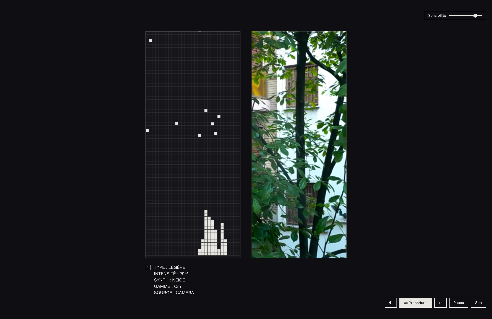

# Un hommage à Bâton de pluies

A browser-based recreation and reinterpretation of the audiovisual installation [*Bâton de pluies*](https://ilpleut.studio) by **[lolalevient](https://www.instagram.com/ilpleut.studio)** and **[AIRMOW](https://www.instagram.com/airmowmusic)**, extended with live webcam motion detection so any movement in front of your camera — leaves outside a window, blinking server LEDs, falling rain — composes generative ambient music in C minor.

> 🎨 The original work belongs to its makers. This is a recreation, built to learn from it. See [ESSAY.md](./ESSAY.md) for the full story behind this project.



---

## What it does

Two narrow vertical panels, side by side.

**Left panel** — a paper-thin grid where black square pixels fall like rain, accumulate at the bottom in shifting clusters, and slowly evaporate. Each landing triggers a soft note in C minor pentatonic, with column position mapped to pitch.

**Right panel** — by default, a procedurally-rendered rainy window with hundreds of tiny water droplets and occasional streaks running down through them. Switch it to live webcam, and motion in front of the camera drives the drops on the left.

**Audio** — generative C minor ambient. A slow pad cycles `i – VI – III – VII` underneath. Brown noise filtered through a slow LFO suggests rainfall. Each pixel landing rings a bell-like sine note through reverb and delay.

**Themes** — auto-detects your system light/dark mode preference; toggle button overrides. Light mode reads like a gallery print; dark mode like a starscape.

## Quick start

### Just want to try it in a browser?

The simplest path: clone this repo, then serve the folder over `localhost`. The webcam API requires `https://` or `localhost` — opening the file with `file://` won't let the camera activate.

```bash
git clone https://github.com/annbjer/un-hommage-a-baton-de-pluies.git
cd un-hommage-a-baton-de-pluies
python3 -m http.server 8000 --bind 127.0.0.1
```

Then open <http://localhost:8000/un-hommage-a-baton-de-pluies.html> in Chrome (or Safari, Firefox, Brave, Arc — anything modern). Click ▶ Entrer, then 📷 Caméra to enable webcam motion detection. The `--bind 127.0.0.1` flag ensures the server is reachable only from your own machine, not your local network.

### Want it as a real macOS app?

The repo includes scripts that wrap the HTML into a double-clickable `.app` bundle — no Electron, no Node, no dependencies beyond what macOS ships with.

```bash
chmod +x launch-baton-de-pluies.sh setup-app.sh
./setup-app.sh
```

This creates `Un hommage à Bâton de pluies.app` in the same folder. Double-click to launch. It'll open in a chromeless Chrome window pointed at the local server, with camera permission persisted across launches in a sandboxed profile under `~/Library/Application Support/HommageBatonDePluies/`.

The `.app` is a thin wrapper that calls back into this folder, so **don't move the `.app` away from the repo folder** — move them together if you want to relocate. The `.app` is also git-ignored (each user generates their own).

### Want to host it on the public web?

Drop `un-hommage-a-baton-de-pluies.html` on any static host (GitHub Pages, Netlify, Cloudflare Pages, your own server). It's a single self-contained file. The webcam will work as long as the page is served over `https://`.

## Controls

| Button | Function |
|---|---|
| **◐** | Toggle light / dark theme |
| **📷 Caméra** | Enable webcam (motion drives the drops). Click again to return to procedural rain. |
| **⇄** *(visible when camera is on)* | Flip between front and rear camera. Mostly useful on phones / iPads. On desktops with no rear camera, the request gracefully falls back to the front camera. |
| **Pause** | Freeze the simulation |
| **Son** | Mute / unmute audio |
| **Sensibilité slider** *(visible when camera is on)* | Adjust motion-detection threshold. Right = more sensitive. |

You can also click and drag in the left panel to add drops manually.

## How it works

Everything is in a single HTML file — about 1,000 lines including comments. Two libraries via CDN: [p5.js](https://p5js.org) for canvas drawing, [Tone.js](https://tonejs.github.io) for audio synthesis. No build step, no bundler.

The interesting bits, briefly:

- **Procedural water droplets** are layered ellipses (shadow → body → refractive glow → specular highlight → meniscus rim), drawn once into an offscreen buffer at startup so the runtime cost is just blitting.
- **Motion detection** is classic frame-differencing: each frame, compare pixel luminance to the previous frame; differences above a threshold count as motion. Per-column motion totals map to drop spawn probabilities on the grid.
- **Pitch mapping** uses column position to pick from C minor pentatonic across multiple octaves, so the same column tends to sing the same note. Motion in different parts of the camera frame plays different pitches.
- **Performance** — canvas rendered at `pixelDensity(1)` (not 2 — retina rendering at native density was the main bottleneck), motion processing throttled to ~30Hz with `willReadFrequently: true` on the offscreen canvas for fast pixel readback.

## iPhone / iPad

The web version runs well on iOS Safari and supports both front and rear cameras (use the ⇄ button to flip). A few iOS-specific notes:

- iOS requires a *user tap* before audio can start. The ▶ Entrer splash screen handles this — just tap to begin.
- For the camera to work, the page must be served over HTTPS (or `localhost`). Hosting the file on GitHub Pages, Netlify, or any modern static host satisfies this automatically.
- For a near-native experience, open the page in Safari, tap the Share button, and choose **Add to Home Screen**. The icon launches the app fullscreen with no Safari chrome.
- Audio may suspend briefly when you switch apps or lock the screen — tap to resume. This is iOS being protective of battery and ringer behavior, not a bug.

The vertical phone layout actually suits the original art well — two stacked panels feel closer to the original installation than the desktop side-by-side layout.

## Privacy

The webcam feed never leaves your device. There is no server-side component to this project — even the `python3 -m http.server` is just serving static files. Motion detection happens entirely in your browser. Closing the tab or clicking the camera button again stops the camera immediately and the camera light goes off.

## Credits & inspiration

- **[lolalevient](https://www.instagram.com/ilpleut.studio) & [AIRMOW](https://www.instagram.com/airmowmusic)** — for *Bâton de pluies*, the original installation that inspired this recreation. Go look at their work.
- **[@FigsFromPlums](https://x.com/FigsFromPlums/status/2048749126439829716)** — for sharing the video that introduced me to it.
- **[p5.js](https://p5js.org)** by the Processing Foundation — the creative coding library that does most of the heavy lifting on the visual side.
- **[Tone.js](https://tonejs.github.io)** by Yotam Mann — the Web Audio framework that makes the generative sound possible.
- **Anthropic's Claude (Opus 4.7)** — pair-programmer for the conversational build process that made this possible for me as a non-coder. See [ESSAY.md](./ESSAY.md) for more on what that collaboration looked like.

## License

MIT — see [LICENSE](./LICENSE). The license covers this code recreation only; the original *Bâton de pluies* installation is the property of its makers and is not covered by this license.

## Contributing

Forks, issues, and pull requests welcome. Some directions that might be interesting to explore:

- A MIDI output mode so the generative notes can drive an external synth or DAW.
- WebGL shaders for the rainy-window panel (the current procedural version is canvas2D and could be much faster + prettier on a GPU).
- Alternative scales / modes beyond C minor pentatonic — Phrygian, Dorian, custom microtonal tunings.
- OSC output for sending motion data to TouchDesigner, Max/MSP, or VCV Rack.
- Sensitivity tuning per-column so you can mask out parts of the camera frame.

If you build something on top of this, I'd genuinely love to see it.
